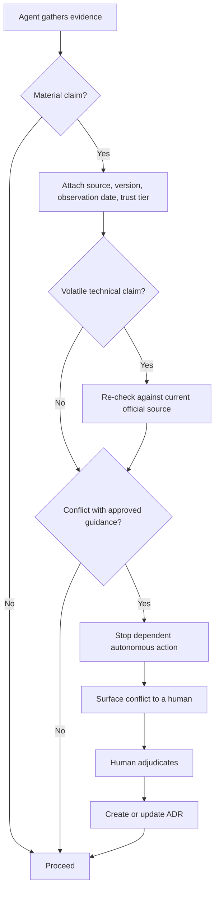

# Evidence policy

This policy governs how agents and contributors working in repositories generated
from `josunefoOrg/golden-repo` treat information they capture, retrieve, or are
told. It extends the AI Agent Risk Management framework (see
[Copilot agents](agents.md)) with an explicit model for **evidence trust and
freshness**.

The framework already isolates and protects *approved* grounding sources. This
policy adds the missing dimension: captured information is not automatically
trustworthy, approved guidance can go stale as new capabilities ship, and
conflicts between sources must be resolved by a human and recorded.

## Why this exists

Approved grounding answers "what may the agent trust by default." It does not
answer "what happens when a fresher, lower-trust source contradicts approved
guidance," or "how do we keep a good-but-now-stale decision from silently
misleading us." Fast-moving platforms make this concrete: an API that does not
exist today may exist tomorrow, so a sound decision made around a missing
endpoint can become wrong within days.

Rather than a one-way membrane that only promotes vetted content into an
authoritative layer, this policy uses **controlled visibility across all
sources**:

- Approved sources guide current decisions.
- Historical and raw sources provide context and emerging evidence.
- Fresh, lower-trust information may challenge an approved source.
- When sources conflict, the agent surfaces the conflict and asks a human to
  decide.

## Principles

1. **Approved guidance is the default, not the only visible evidence.** Agents
   act on approved sources first, but historical, raw, and lower-trust sources
   remain visible as context and emerging evidence. They are never silently
   discarded.

2. **Volatile technical claims must be checked against current official
   sources.** Any claim about API surface, capabilities, limits, versions, or
   availability is treated as volatile and re-verified against the current
   authoritative source at the time of use, not assumed from prior capture.

3. **Every material claim must include source, version, and observation date.**
   A material claim is one that a decision or action depends on. It must carry
   its provenance so freshness and trust can be judged later.

4. **Fresh, lower-trust evidence may challenge approved guidance but cannot
   silently override it.** Newer evidence can open a conflict against an approved
   source. It does not win automatically; it triggers adjudication.

5. **Material conflicts must stop autonomous action and request human
   adjudication.** When a material conflict is detected, the agent halts the
   dependent autonomous action and escalates to a human decision-maker. It does
   not proceed on its own judgment.

6. **Human decisions must produce an ADR or update an existing one.** Every
   adjudicated conflict results in a new
   [Architecture Decision Record](adr/) or an update to (or supersession of) an
   existing one, so the resolution is durable and auditable.

## Trust tiers

| Tier | Examples | Default use |
| ---- | -------- | ----------- |
| **Approved** | Vetted, promoted grounding sources; accepted ADRs | Guides current decisions and autonomous action |
| **Official (current)** | Live official documentation, product APIs, first-party changelogs at time of use | Authoritative for verifying volatile claims |
| **Historical / raw** | Prior captures, notes, transcripts, superseded docs | Context and emerging evidence; may challenge, never silently overrides |

## Evidence metadata

Every material claim recorded in a decision, ADR, or agent output must include:

- **Source** - where the claim came from (URL, document, tool, or system).
- **Version** - the version, revision, or commit the claim reflects, when
  applicable.
- **Observation date** - when the claim was observed or last verified.
- **Trust tier** - Approved, Official (current), or Historical / raw.

## Conflict and adjudication flow



ASCII equivalent:

```text
gather evidence
  -> material claim?
       no  -> proceed
       yes -> attach source/version/observation date/trust tier
              -> volatile technical claim? -> re-check current official source
              -> conflict with approved guidance?
                   no  -> proceed
                   yes -> stop autonomous action
                          -> surface conflict to a human
                          -> human adjudicates
                          -> create or update ADR
                          -> proceed
```

## How this is enforced

- The [Framework Compliance Reviewer](agents.md) checks pull requests for
  material claims that lack source/version/observation date, and for conflicts
  resolved without an ADR.
- The [AI Risk & Security Advisor](agents.md) coaches on evidence freshness and
  the conflict-to-adjudication path in addition to grounding isolation.
- "Stop autonomous action" reuses the existing human gate: the branch-protection
  baseline and Code Owner review (see [Branch protection](branch-protection.md))
  are where an adjudication decision and its ADR are approved before merge.

## Relationship to the security baseline

This policy complements, and does not replace, the grounding-source isolation and
integrity controls in the [Security baseline](security.md). Isolation answers
*who may read what*; this policy answers *how much to trust it and when it goes
stale*.
